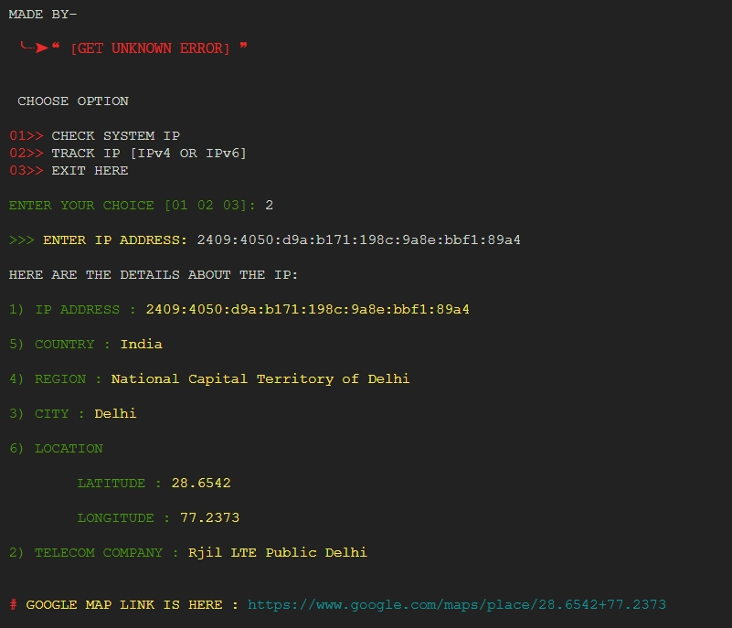

# IP Address Locator

This Python script allows you to check your system's IP address and track details of any IP address (IPv4 or IPv6). It uses the `ip-api.com` service to fetch IP address details and displays the information in a user-friendly format.

## Screenshot



## Features

- Check the system's IP address.
- Track details of any given IP address.
- Displays information such as IP address, country, region, city, latitude, longitude, and the ISP.
- Provides a Google Maps link to the IP's location.
- Option to open the location link directly in a browser.

## Requirements

- Python 3.x
- Internet connection
- Required libraries: `webbrowser`, `sys`, `os`, `json`, `urllib`

## Usage

### Setup for Linux:

1. **Clone the Repository**

    ```sh
    git clone https://github.com/GET-UNKNOWN-ERR0R/Track-IP.git
    cd Track-IP
    ```

2. **Make the `run-script.sh` file executable:**

    Ensure that the `run-script.sh` file is executable. Run the following command to grant executable permissions:
    ```sh
    chmod +x run-script.sh
    ```

3. **Run the Script Using `run-script.sh`:**

    You can now run the Python script by executing the `run-script.sh` file:
    ```sh
    ./run-script.sh
    ```

   The `run-script.sh` file will automatically handle the environment setup (if necessary) and execute the Python script.

### Running Manually (Without Linux-)

1. **Clone the Repository:**

    ```sh
    git clone https://github.com/GET-UNKNOWN-ERR0R/Track-IP.git
    cd Track-IP
    ```

2. **Install Required Python Libraries:**

    If you don't have the required libraries installed, you can install them using `pip`. Run the following command:

    ```sh
    pip install -r requirements.txt
    ```

    If there is no `requirements.txt`, you can manually install the libraries:

    ```sh
    pip install webbrowser sys os json urllib
    ```

3. **Run the Script:**

    Execute the following command to start the script:

    ```sh
    python iptracker.py
    ```

4. **Choose an Option:**

    - `01` - Check System IP: This will fetch and display the IP address details of the current system.
    - `02` - Track IP: Enter an IP address to fetch and display its details.
    - `03` - Exit: Exit the script.

## Code Explanation

The script contains the following main components:

### 1. Class `IPAddressLocator`

This class handles all functionalities of the script.

- **Attributes:**
  - `COLORS`: A dictionary defining color codes for terminal output.

- **Methods:**
  - `__init__`: Initializes the path attribute to check if the script is running in Termux.
  - `clear_screen`: Clears the terminal screen.
  - `display_header`: Displays the script header.
  - `display_menu`: Displays the main menu and handles user input.
  - `display_ip_details`: Displays details of the IP address fetched from the API.
  - `ask_to_open_browser`: Prompts the user to open the Google Maps link in a browser.
  - `fetch_ip_details`: Fetches IP details from the API.
  - `track_ip`: Prompts the user to enter an IP address and fetches its details.
  - `check_system_ip`: Fetches and displays the system's IP address.
  - `run`: Starts the script and handles exceptions.

### 2. Script Execution

The script starts by creating an instance of `IPAddressLocator` and calling its `run` method.

## License

This project is licensed under the MIT License - see the [LICENSE](LICENSE) file for details.

